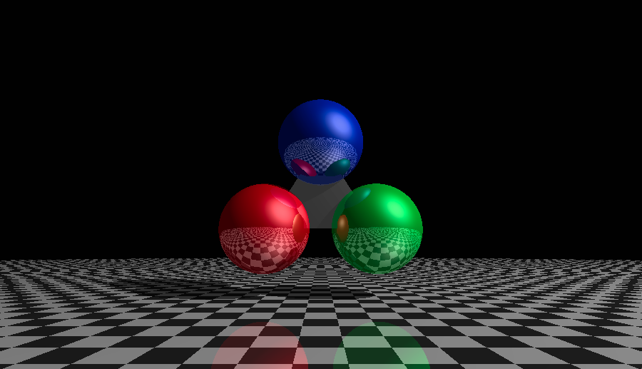
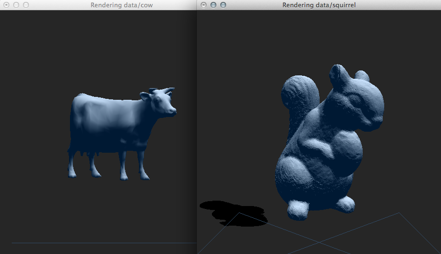

Computer Graphics
=================

Assessments of a Computer Graphics Course I attended at the
RheinMain University of Applied Sciences. This repository
contains all assessments every student had to solve in order
to complete the practical part of the course. Every task had a time
limit of two weeks to complete.

t1-raytracer
------------

  The first task was to write a program that enabled the
  user to render Spheres, Triangles and Planes via ray tracing.
  Shading should be accomplished by implementing the
  Phong Reflection Model.

  

t2-objv
-------

  The second task focused on the basics of OpenGL. The (deprecated)
  fixed function rendering pipeline should be used to render
  .obj files with VBO's and different shading models. Most parameters, like
  colouring, viewing angle, zoom etc. must be adjustable at runtime.
  An extensive list of all options can be found in the projects
  readme.

  
